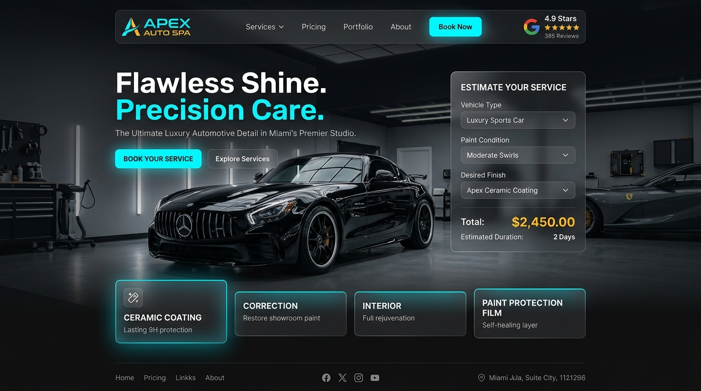

# Apex Auto Spa — Luxury Car Wash & Detailing Landing Page



A modern, high-converting automotive detailing and car wash landing page built with **Laravel 11** and zero database requirements. Designed with a luxury dark carbon aesthetic, vibrant electric cyan accents, and interactive client widgets.

Developed by **[Dylan Ramos](https://dylanramos.vercel.app)**.

---

## ⚡ Key Features

- **Zero Database Configuration**: Powered entirely by file-based sessions and cache—runs instantly without setting up MySQL or SQLite.
- **Interactive Before & After Slider**: Draggable split-screen comparison showing paint swirl eradication and 9H ceramic mirror gloss.
- **Live Transparent Price Estimator**: Instant dynamic calculations for Sedan, Compact SUV, Full SUV, Truck, and Exotic vehicles.
- **All-Inclusive Package Cards**: Express Refresh ($39), Signature Detail ($129), and Platinum Ceramic ($349).
- **Instant Booking & Quote System**: Validates appointment bookings directly in Laravel and generates unique reference codes (`APX-XXXXXX`) with an instant WhatsApp connect link.
- **Accessible HTML5 Dialog Modal**: Native accessible `<dialog>` component for instant booking receipts.
- **Custom Automotive Favicon & Branding**: Hand-crafted SVG favicon with glow effects for browser tabs.
- **100% Passing Automated Tests**: Feature tests covering page rendering, web form booking, JSON AJAX booking, and validation.

---

## 🛠️ Tech Stack

- **Backend**: Laravel 11 (PHP 8.3)
- **Frontend**: Blade Templating, Vanilla CSS (Design Tokens & Glassmorphism), Vanilla JavaScript (No heavy runtime libraries)
- **Testing**: PHPUnit / Laravel Feature Testing Suite
- **Deployment**: Zero-database ready (Deployable on Laravel Cloud, Vercel, Railway, or VPS)

---

## 🚀 Quick Start

1. **Clone the repository**:
   ```bash
   git clone https://github.com/Dyl4nweb/Apex-Auto-Spa.git
   cd Apex-Auto-Spa
   ```

2. **Install PHP dependencies**:
   ```bash
   composer install
   ```

3. **Configure environment**:
   ```bash
   cp .env.example .env
   php artisan key:generate
   ```

4. **Start the local server**:
   ```bash
   php artisan serve
   ```
   Open `http://localhost:8000` in your browser.

5. **Run tests**:
   ```bash
   php artisan test
   ```

---

## 👨‍💻 Author

**Dylan Ramos**  
- Portfolio: [dylanramos.vercel.app](https://dylanramos.vercel.app)  
- GitHub: [@Dyl4nweb](https://github.com/Dyl4nweb)

---

## 📄 License

This project is open-source under the [MIT License](LICENSE).
